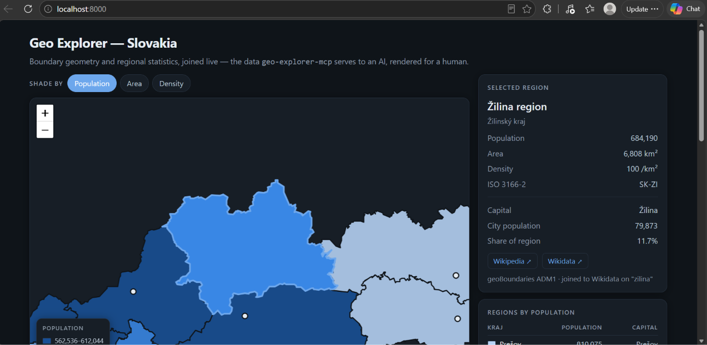

# geo-explorer-mcp

An [MCP](https://modelcontextprotocol.io) server that serves **country facts,
administrative boundaries and regional statistics** as structured data, so an
AI assistant can build interactive geography instead of reciting it.

The server deliberately returns **data, not prose**. It hands back populations,
polygons and coordinates; the model decides how to present them — as a clickable
map, a comparison table, or a lesson in Slovak, German or Hungarian. Nothing in
this server knows how to translate, and it does not need to.



## Tools

| Tool | Arguments | Returns |
|---|---|---|
| `get_country_profile` | `country` | Capitals with coordinates, population, area, region, currencies, languages (English **and** native names), bordering countries, flag, Wikipedia link |
| `get_map_data` | `country`, `level` = `ADM0` \| `ADM1` \| `ADM2` | Region names and a **browser-fetchable** GeoJSON URL, plus source, licence, vintage and data-quality warnings |
| `get_region_details` | `country` | Per-region population, area, capital city (with its own population and coordinates), native names, subdivision type, Wikidata and Wikipedia links |

`country` accepts a name in almost any language — `Slovakia`, `Slovensko`,
`Magyarország`, `Magyarorszag` (no diacritics), `Deutschland`, `Ungarn`.

The two boundary and statistics tools are designed to be **joined**:
`get_region_details` returns a `match_key` per region, and a `join_hint`
telling the model how to normalise `get_map_data`'s names to match it.

## Quick start

```bash
git clone https://github.com/arninemeth-prog/geo-explorer-mcp
cd geo-explorer-mcp
uv sync
```

Copy `.env.example` to `.env` and fill it in:

```
RESTCOUNTRIES_API_KEY=rc_live_...          # free: https://restcountries.com/sign-up
GEO_EXPLORER_CONTACT=https://github.com/you/your-repo
```

`GEO_EXPLORER_CONTACT` goes into the User-Agent sent to Wikidata. Wikimedia
requires a contact URL or email and answers anything else with `403`.

Try it in the MCP Inspector:

```bash
uv run fastmcp dev inspector server.py
```

### Claude Desktop

Add this to `claude_desktop_config.json` (on Windows,
`%APPDATA%\Claude\claude_desktop_config.json`), adjusting the paths:

```json
{
  "mcpServers": {
    "geo-explorer": {
      "command": "C:\\path\\to\\geo-explorer-mcp\\.venv\\Scripts\\python.exe",
      "args": ["C:\\path\\to\\geo-explorer-mcp\\server.py"]
    }
  }
}
```

Pointing at the project's own `.venv` interpreter means Claude runs exactly what
you tested, with no second environment to keep in sync. Restart Claude Desktop
fully afterwards — the config is only read at startup.

Then ask it something like:

> Show me an interactive map of Slovakia's regions, shaded by population, in German.

## Demo page

`demo/index.html` renders Slovakia's 8 *kraje* from the same two sources the
server uses, joined in the browser: shading by population, area or density,
capital markers, and per-region links out to Wikipedia and Wikidata.

It must be **served over http**, not opened as a file — a `file://` page has a
null origin and the browser blocks its cross-origin fetches:

```bash
cd demo
python -m http.server 8000     # then open http://localhost:8000
```

## Tests

```bash
uv run python probe2.py        # all three tools, plus the boundary/statistics join
uv run python probe_names.py   # country-name resolution across languages and spellings
```

`probe2.py` asserts that `geojson_url` is the resolved media URL — see the first
field note below for why that assertion exists.

## Field notes

Things that cost real debugging time, written down so they don't cost yours.

**REST Countries v3.1 is gone.** Nearly every tutorial online still uses it. v5
lives at a different host, requires a bearer token, and renamed every field
(`area` → `area.kilometers`, `cca3` → `codes.alpha_3`, and `capitals` is now an
array of objects, not strings).

**geoBoundaries GeoJSON is stored in Git LFS**, and only
`media.githubusercontent.com` serves it to a browser:

- `raw.githubusercontent.com/...` returns a **131-byte LFS pointer file**, not geometry.
- The `github.com/.../raw/...` URL the API publishes **302-redirects** with an
  *empty* `access-control-allow-origin`. Browsers enforce CORS on every hop of a
  redirect, so a page fetching it fails with `TypeError: Failed to fetch` even
  though the final response sends `access-control-allow-origin: *`.

Either mistake produces a blank map with no error. `get_map_data` resolves the
redirect and returns the URL that actually works.

**Verifying with `curl` does not verify browser behaviour.** `curl -L` followed
that redirect happily and reported the permissive header on the final response.
It ignores CORS entirely. Test cross-origin fetches with an `Origin` header, or
in a browser.

**Wikidata's area property mixes units.** `P2046` values are entered in square
kilometres, hectares *or* square metres, and the raw number carries no hint
which. Reading it directly gave Békéscsaba an area of 193,930,000 km² — it is
193.9 km², recorded in m². Use the *normalised* value
(`p:P2046/psn:P2046`), which Wikidata converts to SI base units.

**ISO 3166-2 mixes administrative levels.** Hungary returns 43 subdivisions: 19
counties, Budapest, and 23 cities with county rights. The cities sit *inside* the
counties, so their areas and populations must not be summed, and there are far
fewer boundary shapes than entries. `get_region_details` returns
`subdivision_types` and warns via `data_quality_notes`.

**Country-name matching folds case but not diacritics.** `Magyarország` resolves;
`Magyarorszag` does not. Translations (`Ungarn`, `Hongrie`) are excluded from the
name aggregate on purpose. The server works around both with a three-step
fallback: the name aggregate, then the translations endpoint, then a locally
built diacritic-folded index.

**Some upstream region names are damaged.** geoBoundaries' ADM2 names for
Slovakia are truncated and mistransliterated (`Prešov` → `Predov`, `Dolný Kubín`
→ `Dolne Kub`). The *geometry* is fine. `get_map_data` detects this and returns a
`data_quality_note` so a model does not present corrupted names as fact.

**No `#` comments inside a SPARQL query that gets collapsed to one line.** In
SPARQL `#` comments out the rest of the *line*; after collapsing, that is the
entire query. Symptom: `HTTP 400`.

## Data sources

| Source | Used for | Licence |
|---|---|---|
| [REST Countries v5](https://restcountries.com) | Country facts | Free tier, API key required |
| [geoBoundaries](https://www.geoboundaries.org) | Administrative boundaries | CC BY 4.0 / ODbL, varies per country — the tool returns the actual licence per request |
| [Wikidata](https://www.wikidata.org) | Regional statistics, capitals, links | CC0 1.0 |

Boundary licences differ by country because geoBoundaries aggregates national
sources. Slovakia's are OpenStreetMap-derived and therefore **ODbL**, which has
share-alike obligations that CC BY does not. `get_map_data` returns the licence
that applies to the data it just gave you; use that, not a hardcoded string.

## Roadmap

- Publish to PyPI so the server installs with `uvx geo-explorer-mcp`
- Repair corrupted ADM2 names by joining to Wikidata
- `compare_countries` for side-by-side statistics
- Cache boundary metadata to disk rather than in memory

## Licence

MIT — see [LICENSE](LICENSE). The data this server returns carries its own
licences; see the table above.
